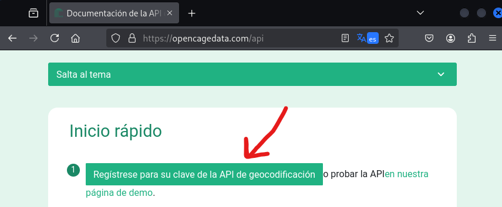
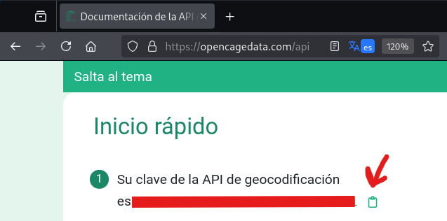
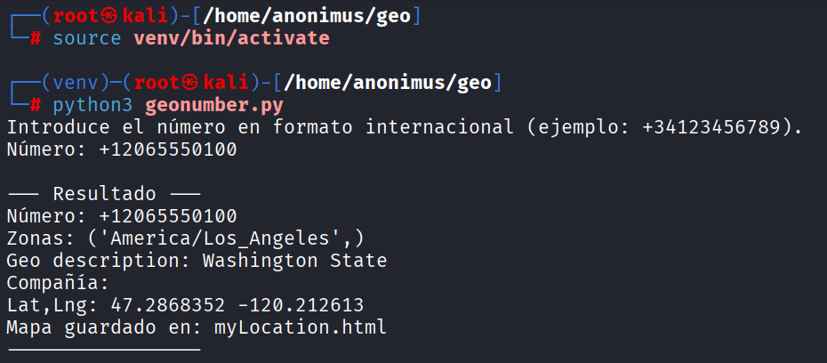
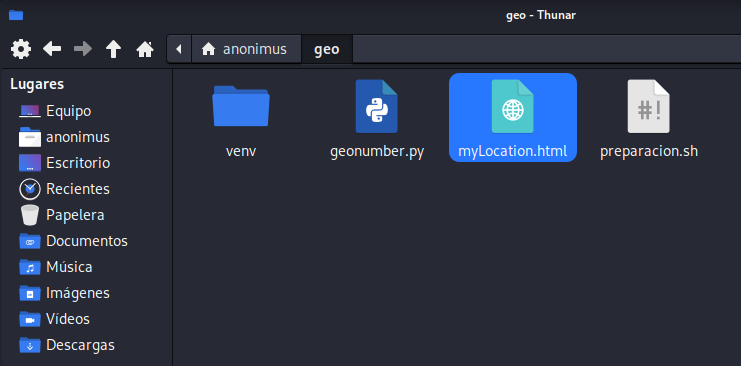
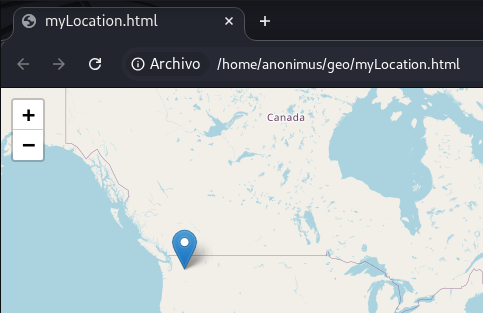

# 📍 Python Phone Tracker - Geolocalización de Números Telefónicos

## 📖 Introducción

Este repositorio contiene una herramienta de **geolocalización de números telefónicos** desarrollada en Python. El sistema permite obtener información de ubicación aproximada a partir de un número de teléfono utilizando APIs de geocodificación y la librería `phonenumbers`.

**🔐 Entorno controlado**: Todas las pruebas se realizaron en un **entorno aislado y seguro** utilizando números de prueba autorizados. El número utilizado en los ejemplos (+12065550100) es un **número de prueba estándar** que no pertenece a ninguna persona real, garantizando así la privacidad y el cumplimiento de las normativas de protección de datos.

**⚠️ Aviso legal**: Esta herramienta se ha desarrollado **exclusivamente con fines educativos** y de investigación legítima. El uso debe cumplir siempre con las leyes locales de privacidad y protección de datos.

## 📑 Índice

1. [🚀 Instalación y Configuración](#-instalación-y-configuración)
2. [🔑 Obtención de la API Key](#-obtención-de-la-api-key)
3. [🎯 Uso de la Herramienta](#-uso-de-la-herramienta)
4. [📊 Resultados y Análisis](#-resultados-y-análisis)
5. [⚠️ Limitaciones y Consideraciones](#-limitaciones-y-consideraciones)

## 🚀 Instalación y Configuración

### Ejecución del Script de Setup

El proyecto incluye un script de automatización que prepara todo el entorno:[script](setup.sh)

```bash
# Dar permisos de ejecución al script
chmod +x setup_locate_number.sh

# Ejecutar el script de instalación
sudo ./setup_locate_number.sh
```

**¿Qué hace el script?**
1. ✅ Actualiza los repositorios del sistema
2. ✅ Instala Python3, pip y entornos virtuales
3. ✅ Crea un entorno virtual aislado
4. ✅ Instala todas las dependencias necesarias
5. ✅ Configura el ambiente para uso inmediato


## 🔑 Obtención de la API Key

### Registro en OpenCage

Para utilizar la geolocalización, necesitas una API key gratuita de OpenCage:

1. **Visitar el sitio web**: [opencagedata.com](https://opencagedata.com/)
2. **Crear una cuenta gratuita**: Registrarse con email
3. **Obtener la API key**: El plan free permite 2500 consultas diarias


*Página de registro de OpenCage - es necesario crear una cuenta gratuita*

### Configuración de la API Key

Una vez obtenida la API key, debes insertarla en el código:

```python
# Editar el archivo geonumber.py
OPENCAGE_KEY = "tu_api_key_real_aqui"  # Reemplazar con tu clave
```


*Documentación de la API mostrando la clave configurada - es crucial usar tu propia key*

## 🎯 Uso de la Herramienta

### Ejecución del Programa

```bash
# Activar el entorno virtual
source venv/bin/activate

# Ejecutar el localizador
python3 geonumber.py
```

### Proceso de Escaneo

El programa solicita un número en formato internacional y realiza:

1. **Validación** del formato del número
2. **Consulta** a la API de geocodificación
3. **Procesamiento** de la información de ubicación
4. **Generación** del mapa interactivo


*Proceso de ejecución mostrando la geolocalización de un número de prueba*

### Ejemplo de Uso
```
Introduce el número en formato internacional (ejemplo: +34123456789).
Número: +12065550100

--- Resultado ---
Número: +12065550100
Zonas: ('America/Los_Angeles',)
Geo description: Washington State
Compañía: 
Lat,Lng: 47.2868352 -120.212613
Mapa guardado en: myLocation.html
```

## 📊 Resultados y Análisis

### Archivos Generados

El programa crea dos tipos de output:

1. **Consola**: Información detallada del análisis
2. **myLocation.html**: Mapa interactivo con la ubicación

### Información Obtenida

- 📞 **Número validado** en formato internacional
- 🌍 **Ubicación geográfica** aproximada
- 🕐 **Zona horaria** asociada al número
- 📍 **Coordenadas GPS** (latitud, longitud)
- 🏢 **Compañía telefónica** (cuando disponible)

### Visualización del Mapa

El archivo HTML generado contiene un mapa interactivo de Folium:

```bash
# Abrir el mapa en el navegador
xdg-open myLocation.html
```


*Archivo generado*


*Mapa interactivo generado con la ubicación estimada - muestra la región aproximada*

## ⚠️ Limitaciones y Consideraciones

### Precisión de la Geolocalización

- 📍 **Ubicación aproximada**: Basada en el prefijo del número
- 🎯 **No es precisa**: No proporciona ubicación exacta del dispositivo
- 🌐 **Varía por país**: La precisión depende del país y compañía

### Aspectos Técnicos

- 🔌 **Requiere conexión a internet**: Para consultas a la API
- ⏰ **Límite de consultas**: 2500 diarias con plan free
- 🐍 **Dependencias Python**: Requiere librerías específicas

### Consideraciones Legales

- 🔒 **Solo uso educativo**: Para aprendizaje e investigación
- 📝 **Cumplimiento legal**: Respetar leyes de protección de datos
- 👤 **Consentimiento necesario**: Para análisis de números reales

---

**⚖️ Disclaimer Legal**: Esta herramienta está diseñada únicamente para fines educativos. El usuario es responsable de cumplir con todas las leyes locales de privacidad.

**🔐 Ética Profesional**: Siempre obtener consentimiento apropiado antes de cualquier análisis. Los números utilizados en ejemplos son de prueba y no pertenecen a personas reales.
